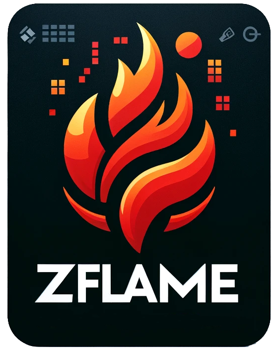

# zflame - Flamegraph Profiling

[](https://github.com/hendriknielaender/zflame/blob/HEAD/LICENSE)

[](https://github.com/hendriknielaender/zflame/blob/HEAD/CONTRIBUTING.md)


zflame is a cutting-edge flamegraph profiling tool designed for the Zig programming language, aimed at simplifying performance analysis and optimization. By leveraging Zig's low-level capabilities, `zflame` provides detailed, interactive flamegraphs that help developers identify and address performance bottlenecks in their applications.

## Features

- 🔥 Generate flamegraphs from various profiler formats (perf, DTrace, sample, etc.)
- 📊 Differential flamegraphs for performance regression analysis
- 🎨 Customizable color schemes and rendering options
- 📈 Stack trace collapsing with multiple algorithm implementations
- 🚀 Streaming parser design for handling large datasets
- 🔧 Both CLI tool and library APIs available

## Installation

### Requirements

- Zig 0.14.0 or later
- No external dependencies required

### Building from Source

```bash
git clone https://github.com/hendriknielaender/zflame
cd zflame
zig build -Doptimize=ReleaseFast
```

The binary will be available at `zig-out/bin/zflame`.

## Usage

### CLI Tool

Generate a flamegraph from perf output:

```bash
# Record performance data
perf record -F 99 -g ./your_program

# Generate perf script output
perf script > perf.out

# Create flamegraph
zflame perf perf.out > flamegraph.svg
```

Supported input formats:
- `perf` - Linux perf events
- `dtrace` - DTrace stack traces
- `sample` - Instruments.app sample format
- `vtune` - Intel VTune Profiler
- `xctrace` - Xcode Instruments

### Differential Flamegraphs

Compare performance between two runs:

```bash
zflame diff-folded before.folded after.folded | zflame flamegraph > diff.svg
```

### Library Usage

```zig
const std = @import("std");
const zflame = @import("zflame");

pub fn main() !void {
    var gpa = std.heap.GeneralPurposeAllocator(.{}){};
    defer _ = gpa.deinit();
    const allocator = gpa.allocator();

    // Parse perf output
    const perf_data = try std.fs.cwd().readFileAlloc(allocator, "perf.out", 1024 * 1024);
    defer allocator.free(perf_data);

    // Collapse stack traces
    var folder = try zflame.perf.Folder.init(.{});
    defer folder.deinit();
    
    const collapsed = try folder.collapse(allocator, perf_data);
    defer allocator.free(collapsed);

    // Generate flamegraph
    const options = zflame.flamegraph.Options{
        .title = "CPU Profile",
        .count_name = "samples",
        .color_scheme = .hot,
    };
    
    const svg = try zflame.flamegraph.generate(allocator, collapsed, options);
    defer allocator.free(svg);
    
    try std.fs.cwd().writeFile("flamegraph.svg", svg);
}
```

## Performance

Benchmarks available in `benchmarks/` directory.

## Architecture

The project follows a modular design:

```
src/
├── collapse/        # Stack trace collapsing algorithms
│   ├── perf.zig    # Linux perf format
│   ├── dtrace.zig  # DTrace stacks
│   └── ...         # Other formats
├── flamegraph/      # SVG generation
│   ├── color.zig   # Color schemes
│   └── parser.zig  # Folded format parser
├── differential.zig # Differential analysis
└── main.zig        # CLI entry point
```

## Acknowledgments

This project is a Zig port of [inferno](https://github.com/jonhoo/inferno/) by [Jon Gjengset](https://github.com/jonhoo). The original Rust implementation provided the algorithmic foundation and design inspiration for zflame. 

Additional thanks to:
- Brendan Gregg for inventing flamegraphs and the original implementation

## License

MIT License - see [LICENSE](LICENSE) for details.

## Related Projects

- [inferno](https://github.com/jonhoo/inferno/) - The original Rust implementation
- [FlameGraph](https://github.com/brendangregg/FlameGraph) - Original Perl implementation
