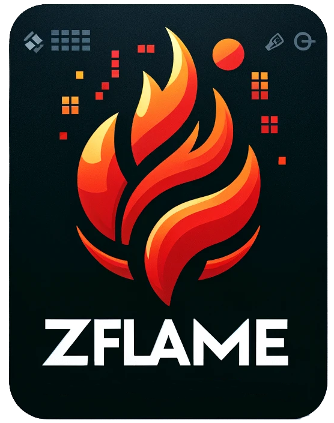

# zflame - Flamegraph Profiling

[![MIT license][license-badge]][license-link]
![GitHub code size in bytes][code-size-badge]
[![PRs Welcome][prs-badge]][contributing-link]


zflame is a cutting-edge flamegraph profiling tool designed for the Zig programming language,
aimed at simplifying performance analysis and optimization. By leveraging Zig's low-level
capabilities, `zflame` provides detailed, interactive flamegraphs that help developers identify
and address performance bottlenecks in their applications.

[license-badge]: https://img.shields.io/badge/license-MIT-blue.svg
[license-link]: https://github.com/hendriknielaender/zflame/blob/HEAD/LICENSE
[code-size-badge]: https://img.shields.io/github/languages/code-size/hendriknielaender/zflame
[prs-badge]: https://img.shields.io/badge/PRs-welcome-brightgreen.svg
[contributing-link]: https://github.com/hendriknielaender/zflame/blob/HEAD/CONTRIBUTING.md

## Features

- 🔥 Generate flamegraphs from various profiler formats (perf, DTrace, sample, etc.)
- 📊 Differential flamegraphs for performance regression analysis
- 🎨 Customizable color schemes and rendering options
- 📈 Stack trace collapsing with multiple algorithm implementations
- 🚀 Streaming parser design for handling large datasets
- 🔧 Both CLI tool and library APIs available

## Installation

### Requirements

- Zig 0.16.0 or later
- No external dependencies required

### Building from Source

```bash
git clone https://github.com/hendriknielaender/zflame
cd zflame
zig build -Doptimize=ReleaseFast
```

The binary will be available at `zig-out/bin/zflame`.

## Usage

### CLI Tool

Generate a flamegraph from perf output:

```bash
# Record performance data
perf record -F 99 -g ./your_program

# Generate perf script output
perf script > perf.out

# Create flamegraph. The input format is an explicit subcommand.
zflame perf perf.out > flamegraph.svg

# Pass options with --key=value syntax.
zflame perf --colors=hot --title="CPU Profile" perf.out > flamegraph.svg
```

Supported input formats:
- `perf` - Linux perf events
- `dtrace` - DTrace stack traces
- `sample` - Instruments.app sample format
- `vtune` - Intel VTune Profiler
- `xctrace` - Xcode Instruments

### Differential Flamegraphs

Compare performance between two runs:

```bash
diff-folded --output=diff.folded before.folded after.folded
```

### Library Usage

```zig
const std = @import("std");
const zflame = @import("zflame");

pub fn main(init: std.process.Init) !void {
    const io = init.io;

    var output_file = try std.Io.Dir.cwd().createFile(io, "flamegraph.svg", .{});
    defer output_file.close(io);

    const collapsed_stacks = [_]zflame.collapse.CollapsedStack{
        .{ .stack = "main;work;hot_path", .count = 42 },
        .{ .stack = "main;work;cold_path", .count = 7 },
    };

    var output_buffer: [16 * 1024]u8 = undefined;
    var output_writer = output_file.writer(io, &output_buffer);

    var generator = zflame.flamegraph.Generator.init(.{
        .title = "CPU Profile",
        .count_name = "samples",
        .palette = .{ .basic = .hot },
    });
    try generator.generate_from_collapsed(&collapsed_stacks, &output_writer.interface);
    try output_writer.interface.flush();
}
```

To collapse raw perf output to folded stacks:

```zig
const std = @import("std");
const zflame = @import("zflame");

pub fn main(init: std.process.Init) !void {
    const io = init.io;

    var input_file = try std.Io.Dir.cwd().openFile(io, "perf.out", .{});
    defer input_file.close(io);

    var output_file = try std.Io.Dir.cwd().createFile(io, "perf.folded", .{});
    defer output_file.close(io);

    var folder = try zflame.perf.Folder.init(.{});
    defer folder.deinit();

    var input_buffer: [16 * 1024]u8 = undefined;
    var output_buffer: [16 * 1024]u8 = undefined;

    var input_reader = input_file.reader(io, &input_buffer);
    var output_writer = output_file.writer(io, &output_buffer);

    try folder.collapse(&input_reader.interface, &output_writer.interface);
    try output_writer.interface.flush();
}
```

## Performance

Benchmarks available in `benchmarks/` directory.

## Architecture

The project follows a modular design:

```
src/
├── collapse/        # Stack trace collapsing algorithms
│   ├── perf.zig    # Linux perf format
│   ├── dtrace.zig  # DTrace stacks
│   └── ...         # Other formats
├── flamegraph/      # SVG generation
│   ├── color.zig   # Color schemes
│   └── parser.zig  # Folded format parser
├── differential.zig # Differential analysis
└── main.zig        # CLI entry point
```

## Acknowledgments

This project is a Zig port of [inferno](https://github.com/jonhoo/inferno/) by
[Jon Gjengset](https://github.com/jonhoo). The original Rust implementation provided the
algorithmic foundation and design inspiration for zflame.

Additional thanks to:
- Brendan Gregg for inventing flamegraphs and the original implementation

## License

MIT License - see [LICENSE](LICENSE) for details.

## Related Projects

- [inferno](https://github.com/jonhoo/inferno/) - The original Rust implementation
- [FlameGraph](https://github.com/brendangregg/FlameGraph) - Original Perl implementation
